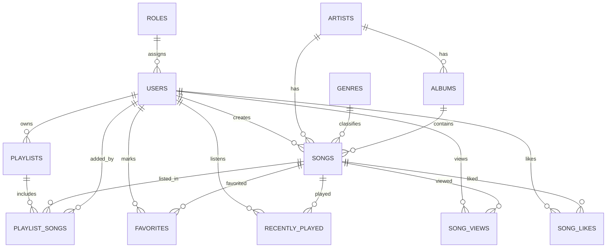

# Phase 2

## Objective

Design and implement a normalized MySQL schema for core music player domain entities with production-grade constraints, indexes, and migration scripts.

## Architecture Decisions

1. Kept master tables isolated: roles, users, artists, genres, albums, songs.
2. Used bridge/activity tables for user behavior and many-to-many relationships: playlist_songs, favorites, recently_played, song_views, song_likes.
3. Added explicit foreign keys and indexed access paths for common query patterns such as search, recently played, playlist loading, and analytics reads.
4. Supported local and external songs in one table using source_type with validation constraint logic.

## Folder Structure Changes

```text
17-music-player/
└── backend/
    └── database/
        ├── migrations/
        │   ├── 001_create_core_schema.sql
        │   └── 001_drop_core_schema.sql
        └── README.md
```

## ER Diagram



## Relationships

- roles 1:N users
- users 1:N playlists
- users 1:N songs via created_by_user_id
- artists 1:N albums
- artists 1:N songs
- genres 1:N songs
- albums 1:N songs (nullable in songs)
- playlists 1:N playlist_songs
- songs 1:N playlist_songs
- users N:M songs via favorites
- users N:M songs via song_likes
- users 1:N recently_played
- songs 1:N recently_played
- users 1:N song_views (nullable user allowed)
- songs 1:N song_views

## Constraints

- Primary keys on all entities
- Unique constraints:
  - roles.name
  - users.username, users.email
  - artists.slug, artists.name
  - genres.name, genres.slug
  - albums.slug
  - songs.slug
  - playlists(user_id, name)
  - playlist_songs(playlist_id, position)
  - playlist_songs(playlist_id, song_id)
  - favorites(user_id, song_id)
  - song_likes(user_id, song_id)
- CHECK constraints:
  - songs.duration_seconds > 0
  - playlist_songs.position > 0
  - songs source integrity for local/external

## Indexes

- FK indexes on all relationship columns
- Composite indexes:
  - songs(is_active, release_date)
  - playlists(is_public, created_at)
  - recently_played(user_id, played_at)
  - recently_played(song_id, played_at)
  - song_views(song_id, viewed_at)
  - song_views(user_id, viewed_at)
- FULLTEXT indexes:
  - artists.name
  - albums.title
  - songs.title

## Migration Scripts

- Forward migration: backend/database/migrations/001_create_core_schema.sql
- Rollback migration: backend/database/migrations/001_drop_core_schema.sql

## Code Explanation

1. 001_create_core_schema.sql creates all required tables in dependency-safe order, adds constraints/indexes, and seeds admin/user roles.
2. 001_drop_core_schema.sql drops tables in reverse dependency order for safe rollback.

## Status

Phase 2 completed.
Waiting for approval to start Phase 3 Backend Setup.
